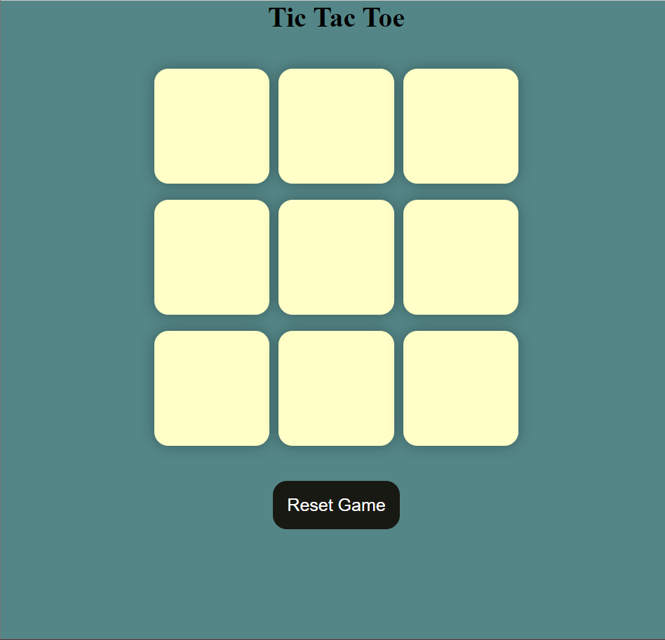
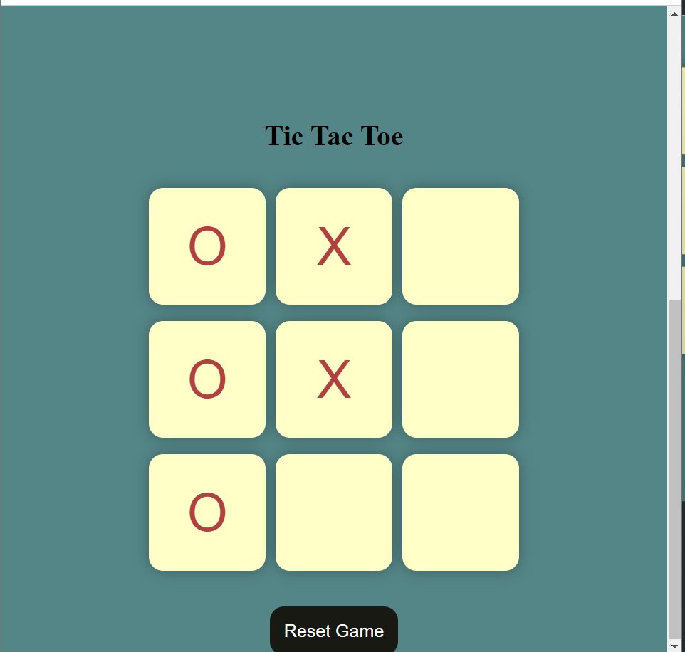
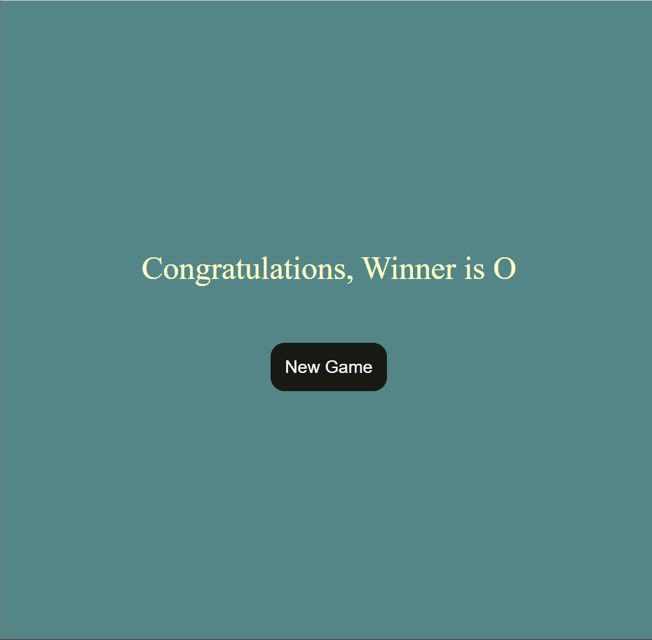
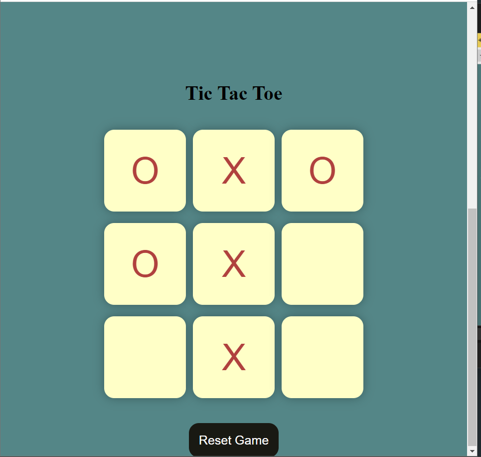
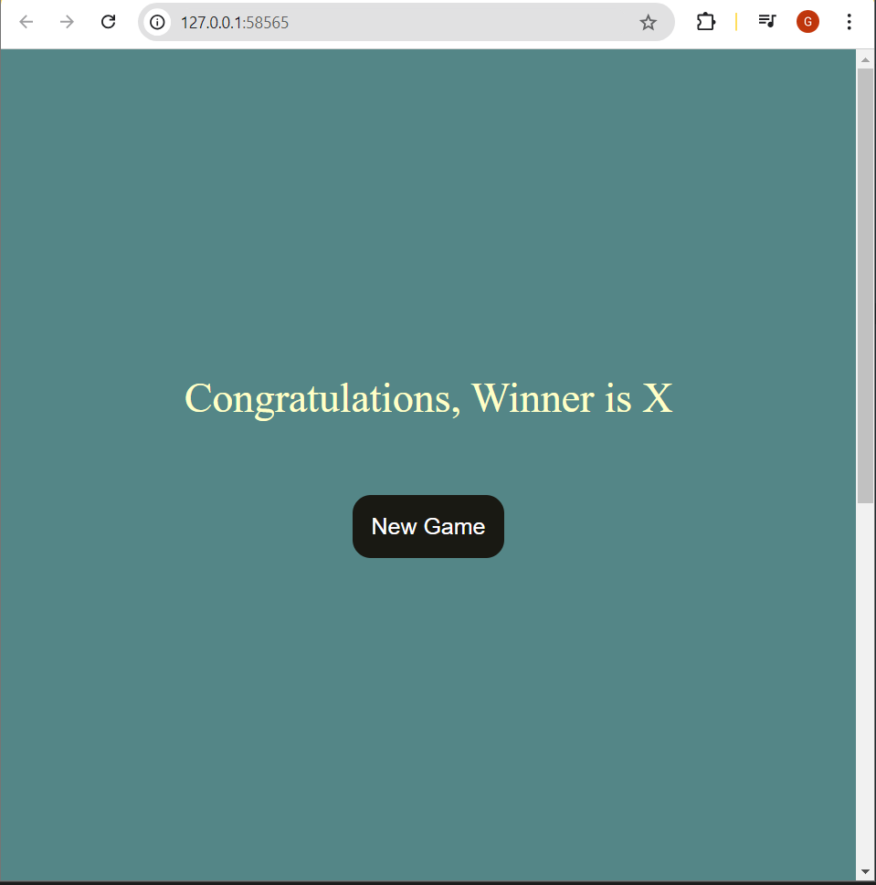
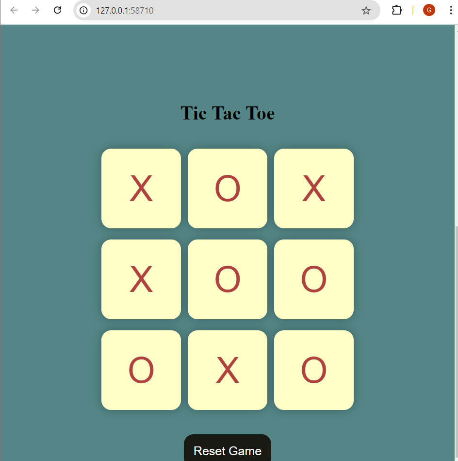
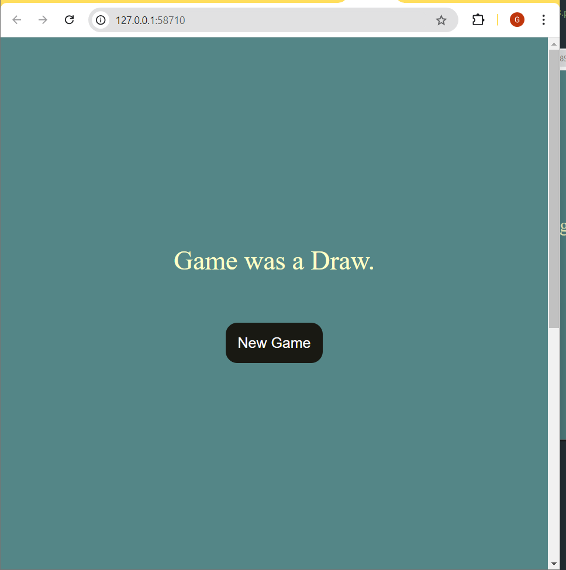

<h1>
Tic-Tac-Toe Game
</h1>
Welcome to the Tic-Tac-Toe game! This project is a web-based version of the classic game built with HTML, CSS, and JavaScript. Play as either Player X or Player O and try to get three in a row to win.
 
<h2>Project Overview</h2>

This mini-project is a digital version of the Tic-Tac-Toe game, which is easy to play yet challenging to master. The game supports:
Two players (Player X and Player O)
Winner Detection based on the traditional 3-in-a-row rule
Draw Detection when all squares are filled with no winner
Option to Reset the game to start a new match
 
<h2>Features</h2>
 
Game Grid: A 3x3 grid of buttons representing the game board.
Responsive Layout: The design adjusts to different screen sizes, making it playable on both desktop and mobile devices.
Winner Detection: The game automatically checks for a winner after each move.
Draw Detection: If no winner is found and all boxes are filled, the game announces a draw.
Game Reset: Players can reset the game anytime and start fresh.
 

<h2>Technologies Used</h2>
 
HTML: Provides the structure and layout of the game.
CSS: Styles the game grid and the UI elements.
JavaScript: Implements the game logic, winner detection, and interactions.
 

<h2>How to Play</h2>
 
Open the Game: Launch the game in a web browser.
Play as X or O: The game starts with Player O's turn. Players take turns clicking on the grid squares.
Win Condition: Get three in a row horizontally, vertically, or diagonally to win the game.
Draw Condition: If all boxes are filled without a winner, the game will announce a draw.
Reset the Game: Use the Reset Game button to start a new match at any time.
 

<h2>Screenshots</h2>

Here are some screenshots of the game:

- **Initial Screen**
  

- **Player O's winning pattern**
  
- **Winning Screen for Player O**
  

- **Player X's winning pattern**
  

- **Winning Screen for Player X**
  

- **Draw Game Pattern**
  

- **Draw screen**
  

 
<h2>Getting Started</h2>
To run the project locally:

<h2>Clone the Repository:</h2>
git clone https://github.com/your-username/tic-tac-toe.git

Open the index.html File: Open index.html in your browser to play the game.
 
<h2>Future Improvements<h2>
Add AI player to play against the computer.
Implement Score Tracking to keep track of wins and losses.
Add a Timer for each turn to increase the challenge.
